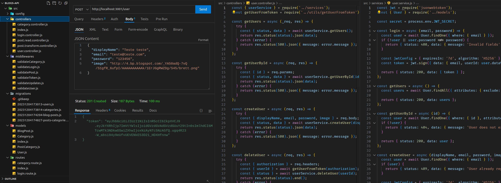

# README: Blogs API



## Project Description

This project is a blog API where you can create an account, log in, write, and read posts. It has been structured using a model/service/controller architecture.

### Technologies

- LINUX
- VSCODE
- NODE.JS
- MYSQL
- JAVASCRIPT
- SEQUELIZE
- JSON WEB TOKEN
- LINT

### What I Learned

- How to make sequelize communicate with a database.
- How to create migrations to create tables.
- How to work with Tokens.

## How to Run the Project

1. Clone the repository:

   ```bash
   git clone https://github.com/feduarte-dev/blogs-api
   ```

2. Navigate to the project directory:

   ```bash
   cd your-repository
   ```

3. Initiate the containers

   ```bash
   docker-compose up -d
   docker exec -it blogs_api bash
   ```
   
4. Install dependencies inside container:

   ```bash
   cd backend
   npm install
   ```

5. If you want to run migrations and seed:

   ```bash
   npm run prestart
   npm run seed 
   npm run dev
   ```

## Contributions

[Felipe](https://www.linkedin.com/in/feduarte-dev/) - /controller - /middlewares - /routes - /models - /services - /migrations


[Trybe](https://www.betrybe.com/) - Everything else
